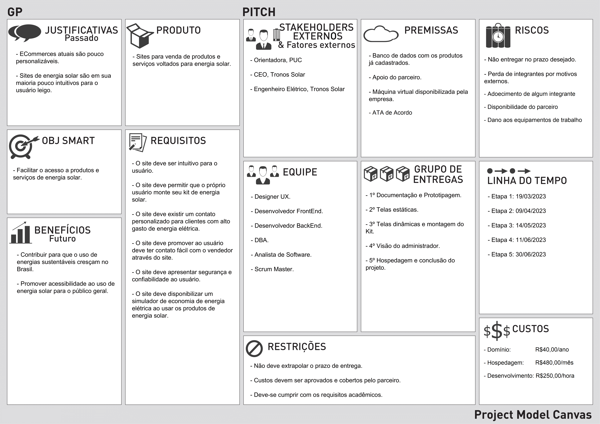
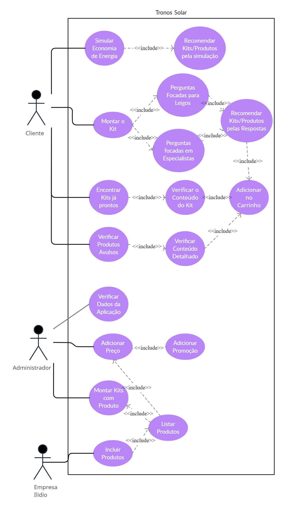
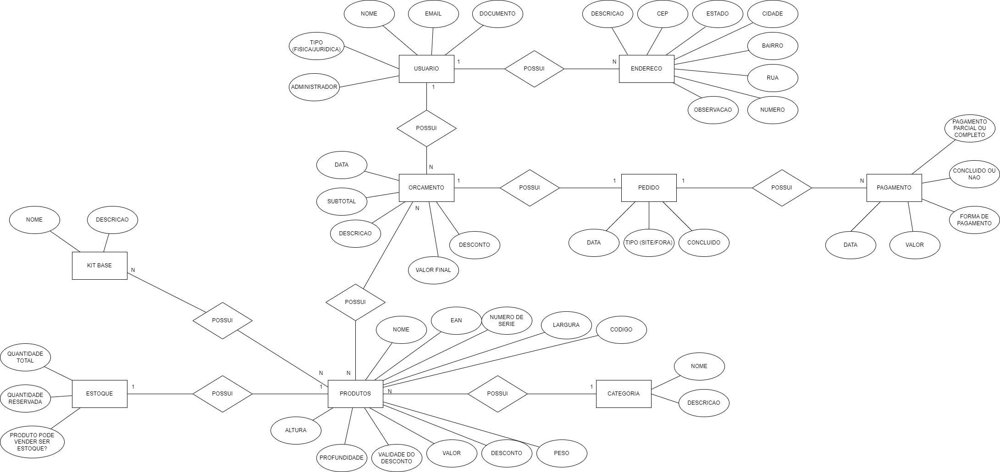
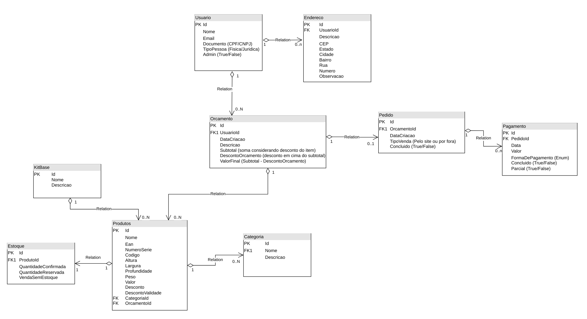

# Especificações do Projeto

Os pontos mais relevantes a serem tratados neste projeto foram abordados e exemplificados através de personas fictícias e suas respectivas histórias, expondo casos comuns dos problemas levantados na pesquisa, que foram elaborados a partir do conhecimento comum e vivência dos membros da equipe.

## Arquitetura e Tecnologias

A aplicação terá um FrontEnd Web feito em HTML, CSS e JavaScript por meio de um framework chamado ReactJs, consumindo de uma API(REST) desenvolvida por C# e seu framework .NET utilizando o Entity Framework para modelar as entidades, as relações e a lógica vinda do Banco de Dados SQL Server.

### Ferramentas

As ferramentas empregadas no projeto são:

| Ambiente                  | Plataforma         | Link de Acesso                                  |
| ------------------------- | ------------------ | ----------------------------------------------- |
| Codificação               | Visual Studio Code | https://code.visualstudio.com/                  |
| Codificação               | Visual Studio      | https://visualstudio.microsoft.com/pt-br/       |
| Comunicação               | Discord            | https://discord.com/                            |
| Comunicação               | Teams              | https://teams.microsoft.com/                    |
| Comunicação               | Google Meet        | https://meet.google.com/                        |
| Prototipagem de Telas     | Figma              | https://www.figma.com/                          |
| Prototipagem de Telas     | Pencil Project     | https://pencil.evolus.vn/                       |
| Diagramação               | Lucidchart         | https://www.lucidchart.com/pages/pt             |
| Versionamento de código   | Git e GitKraken    | https://git-scm.com/ https://www.gitkraken.com/ |
| Repositório, documentação | Github             | https://github.com                              |
| Gerenciamento de projeto  | Trelo              | https://trello.com/                             |

## Project Model Canvas

## Requisitos

As tabelas que se seguem apresentam os requisitos funcionais e não funcionais que detalham o escopo do projeto.

### Requisitos Funcionais

| ID     | Descrição do Requisito                                                                                   | Prioridade |
| ------ | -------------------------------------------------------------------------------------------------------- | ---------- |
| RF-001 | A aplicação deve permitir que o usuário monte o seu próprio kit                                          | ALTA       |
| RF-002 | A aplicação deve exibir um contato personalizado para clientes com valores altos em sua conta de energia | ALTA       |
| RF-003 | A aplicação deve disponibilizar um simulador para calcular a economia na conta de energia                | ALTA       |
| RF-004 | O usuário deve ter acesso ao contato do vendedor                                                         | MÉDIA      |

### Requisitos não Funcionais

| ID      | Descrição do Requisito                                                                                 | Prioridade |
| ------- | ------------------------------------------------------------------------------------------------------ | ---------- |
| RNF-001 | A aplicação deve ser compatível com os principais navegadores Web                                      | ALTA       |
| RNF-002 | A aplicação deve possuir interface intuitiva.                                                          | ALTA       |
| RNF-003 | A aplicação deve passa credibilidade de forma coesa e bem estruturada sobre a empresa e seus produtos. | ALTA       |
| RNF-004 | A aplicação deve possuir meios de autenticação e autorização, para garantir a segurança dos usuários quanto a seus dados pessoais. | ALTA       |

## Restrições

O projeto está restrito pelos itens apresentados na tabela a seguir.

| ID  | Restrição                                                 |
| --- | --------------------------------------------------------- |
| 01  | O projeto deverá ser entregue até o final do semestre     |
| 02  | O projeto deve cumprir com os requisitos acadêmicos       |
| 03  | O projeto não pode gerar encargos para os desenvolvedores |

## Diagrama de Casos de Uso

Os casos de uso mostrando os Requisitos Funcionais para a aplicação são ilustrados abaixo.

## Modelo ER (Projeto Conceitual)

O relacionamento entre entidades e suas propriedades estão descritas abaixo.

## Projeto da Base de Dados

As tabelas que estruturam o sistema, bem como suas ligações, restrições de integridade e chaves estão descritas abaixo.

