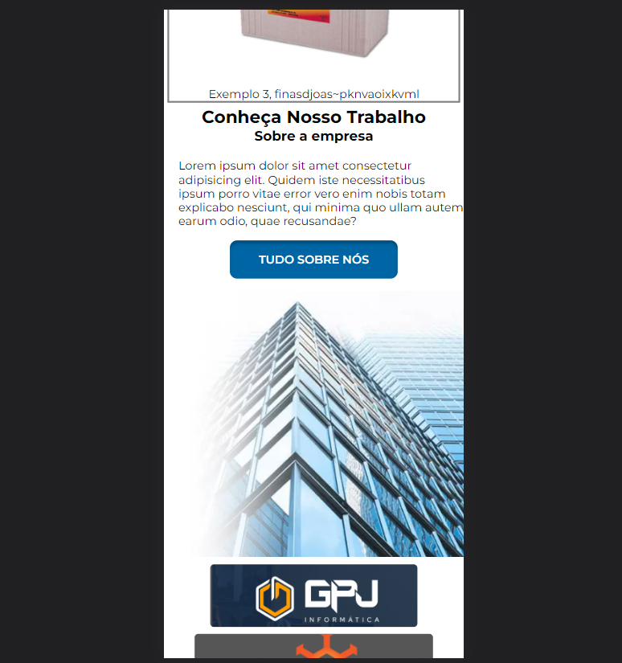
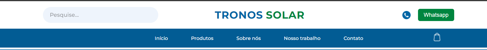
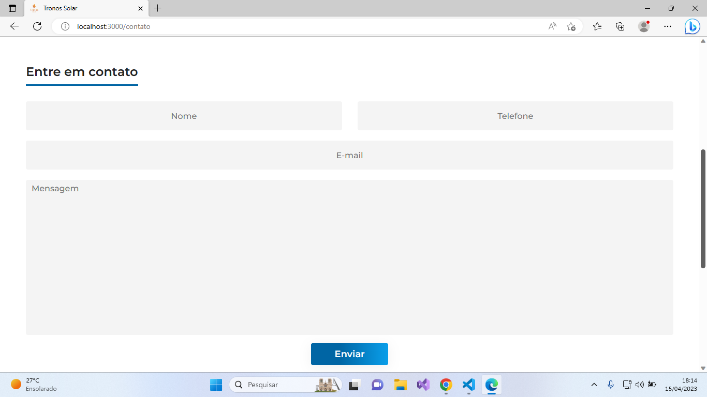
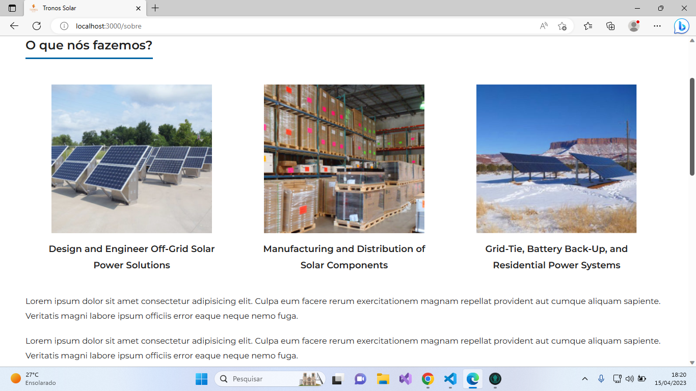

# Planos de Testes de Software

Está seção detalha o planejamentos do processo de realização dos Testes de Software.

|Caso de Teste | CT-01 - Funcionamento Básico - Página inicial|
|:--|:--|
|**Requisitos Associados**|RF-001 - A aplicação deverá calcular a economia com base nas informações passadas pelo usuário e retornar as devidas informações corretamente.   RF-002 - A aplicação deverá aconselhar Kits com base nas informações passadas pelos usuários, sendo separadas em leigos e técnicos.   RF-003 - A aplicação deverá mostrar produtos disponiveis. |
|**Objetivo do teste**| Verificar e testar as funcionalidades básicas necessárias na página inicial para que a aplicação tenha funcionamento positivo. |
|**Passos**|1 - Acessar a aplicação pela URL.   2 - Ao entrar na aplicação Apertar na opção de Simular Quanto irá Economizar.  3 - Responder as informações corretamente.   4 - A aplicação deverá retornar as informações corretamente pelo que foi fornecido.   5 - Apertar na opção Monte seu Kit.   6 - Escolher entre ter conhecimento técnico ou leigo.   7 - Responder as questões corretamente.   8 - A aplicação deverá retornar as opções de Kits já prontos adequada pelas informações passadas.   9 - Ao acessar a aplicação deverá ser exibido alguns dos produtos disponiveis.|
|**Critérios de Êxito**| A aplicação deve ser capaz de calcular a economia de energia possível com sucesso, deverá ser capaz de recomendar opções de Kits corretamente, com base nas informações passadas pelo usuário, sendo escolhido o cohecimento entre técnico ou leigo e a aplicação deverá exibir alguns produtos disponivéis para compra. |

 
 

|Caso de Teste | CT-02 - Funcionamento Básico - Catálogo |
|:--|:--|
|**Requisitos Associados**|RF-004 - A aplicação de deverá exibir os produtos disponivéis.   RF-005 - A aplicação deverá ter a opção de filtro, podendo escolher entre categórias para exibição dos produtos.   RF-006 - A aplicação deverá separar em tópicos os produtos exibidos. |
|**Objetivo do teste**| Verificar se os produtos irão aparecer da forma desejada, tendo opções de filtos e separação entre tópicos internos dos produtos exibidos. |
|**Passos**|1 - Acessar o navegador. 2 - Informar o endereço do site. 3 - Deverá aparecer a página inicial da aplicação. 4 - acessar a opção Produtos no menu da parte superior da aplicação.  5 - Após deverá ser exibido os produtos separados por tópicos.   5 - Na parte da esquerda deverá aparecer os filtros relacionados com os produtos.   7 - Ao clicar no filtro deverá ser alterado os produtos exibidos para produtos relacionados com o filtro escolhido. |
|**Critérios de Êxito**| Ao acessar a página de produtos da aplicação, deverá ser exibido os produtos disponíveis, sendo separado em tópicos relacionados com as especificações dos produtos, no menu à esquerda deverá ter as opções de filtros, ao serem selecionados, a aplicação deverá alterar a exibição para produtos com o filtro escolhido. |

 
 

|Caso de Teste | CT-03 - Funcionamento Básico - Detalhes do Produto |
|:--|:--|
|**Requisitos Associados**|RF-007 - A aplicação deverá exibir as informações do produto selecionado pelo usuário.   RF-008 - Poderá ser escolhido a quantidade do produto desejada, tendo o controle do estoque.   RF-009 - Poderá adicionar o produto selecionado ao carrinho. |
|**Objetivo do teste**| Verificar se as informações do produto selecionado será retornada corretamente, controlar a quantidade ecolhida de acordo com a disponibilizada no estoque e adicionar o produto selecionado ao carrinho. |
|**Passos**|1 - Acessar o navegador. 2 - Informar o endereço do site. 3 - Deverá aparecer a página inicial da aplicação. 4 - acessar a opção Produtos no menu da parte superior da aplicação.  5 - Após deverá ser exibido os produtos.   5 - Selecionar o produto desejado.   7 - Deverá ser exibido as informações do produto selecionado.   8 - Terá a quantidade do produto exibida.   9 - Clicar na opção de somar ou subtrair a quantidade do produto.   10 - Cilcar na opção de adicionar ao carrinho. |
|**Critérios de Êxito**| Ao acessar a parte de Detalhes do Produto, deverá ser exibido todos os dados do produto para o usuário corretamente, o usuário poderá aumentar ou diminuir a quantidade de produtos desejada, respeitando a quantidade já definida no estoque, o usuário poderá adicionar o produto com a quantidade ao carrinho com sucesso. |

 
 

# Plano de Testes de Usabilidade

Planejamento de realização de testes com usuários definindo as operações que os usuários devem realizar.
|Caso de Teste | CT-01 - Responsividade|
|:--|:--|
|**Objetivo do teste**| O usuario deverá acessar a página tanto em um desktop quanto em um mobile para testar a responsividade de todo conteúdo.|
|**Passos**|1 - Acesse o site em um desktop. 2 - Acesse o site em navegador mobile. |
|**Critérios de Êxito**|Conteúdo totalmente responsivo, sem quebras.|

 
 

|Caso de Teste | CT-02 - Realizar Cadastro |
|:--|:--|
|**Objetivo do teste**| O usuario deverá se cadastrar para efetuar suas compras.|
|**Passos**|1 - Entrar na plataforma. 2 - Clicar em Log-In. 3 - Registrar-se.|
|**Critérios de Êxito**|Registrar usuario e armazenar suas informações.|

 
 

|Caso de Teste | CT-03 - Links direcionaveis|
|:--|:--|
|**Objetivo do teste**|Verificar o redirencionamento dos links disponiveis no site.|
|**Passos**|1 - Acessar o site. 2 - Clicar sobre o contéudo disponivel.  3 - Ser redirecionado para uma página.
|**Critérios de Êxito**|Ser redirecionado automaticamente ao clicar em um contéudo incluso.|

 
 

|Caso de Teste | CT-04 - Entrar em contato com o setor responsável por parte da empresa|
|:--|:--|
|**Objetivo do teste**|O usuário poderá entrar em contato diretamente com os setores responsáveis por parte da empresa, através de links, telefones, emails e whatsapp.|
|**Passos**|1 - Acessar o site. 2 - Clicar sobre a opção de Contato no Menu. 3 - Irá abrir a forma de contato corretamente.|
|**Critérios de Êxito**|Conseuir acessar a opção de comunicação corretamente.|

 
 

|Caso de Teste | CT-05 - Visualizar mais informações sobre a empresa responsável|
|:--|:--|
|**Objetivo do teste**|O usuário deverá poder acessar uma parte especifica da aplicão contendo inormações sobre a empresa responsável, visando passar confiabilidade e responsabilidade para o usuário.|
|**Passos**|1 - Acessar o site. 2 - Ir na opção Sobre. 3 - Visualizar as informações. 
|**Critérios de Êxito**|Coneguir acessar as informações sobre a empresa responsável com sucesso, de forma, layout e orgranização visando passar credibilidade, confiança e segurança.|

  
 
# Evidências de Testes de Usabilidade

Apresente imagens e/ou vídeos que comprovam que um determinado teste foi executado, e o resultado esperado foi obtido. Normalmente são screenshots de telas, ou vídeos do software em funcionamento.

|Evidência de Teste | CT-01 - Responsividade|
|:--|:--|
|**Evidência**||

 
 

|Evidência de Teste | CT-03 - Links direcionaveis|
|:--|:--|
|**Evidência**||

 
 

|Evidência de Teste | CT-04 - Entrar em contato com o setor responsável por parte da empresa|
|:--|:--|
|**Evidência**||

 
 

|Evidência de Teste | CT-05 - Visualizar mais informações sobre a empresa responsável|
|:--|:--|
|**Evidência**|   |
